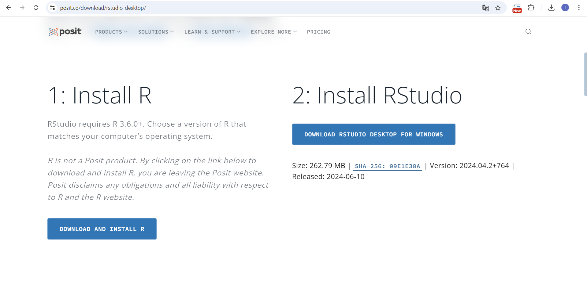
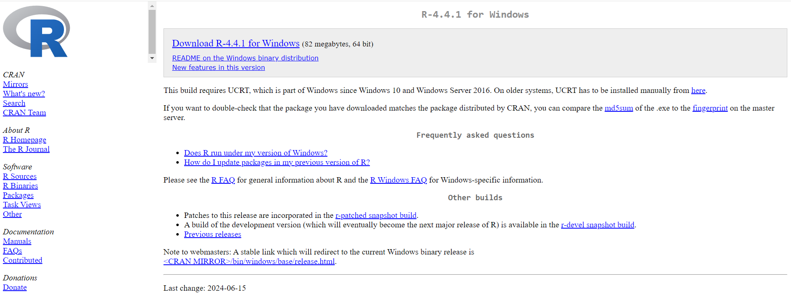
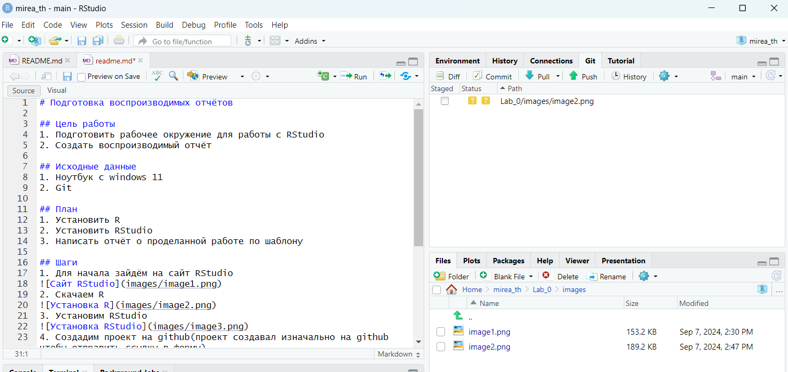
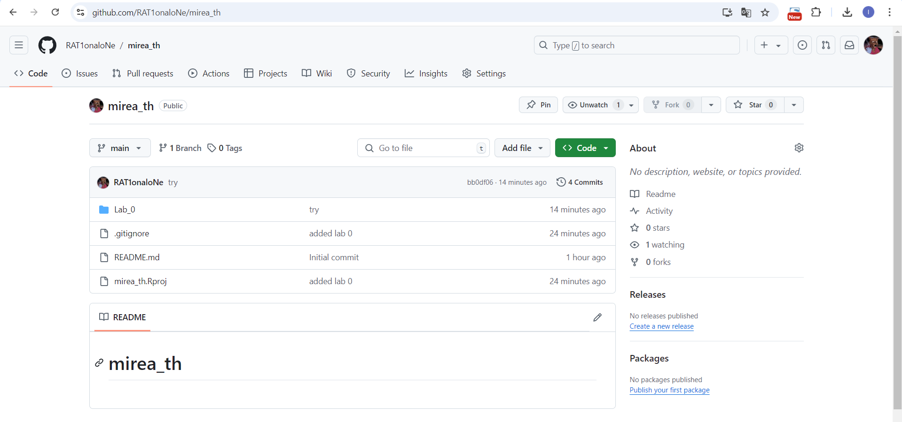
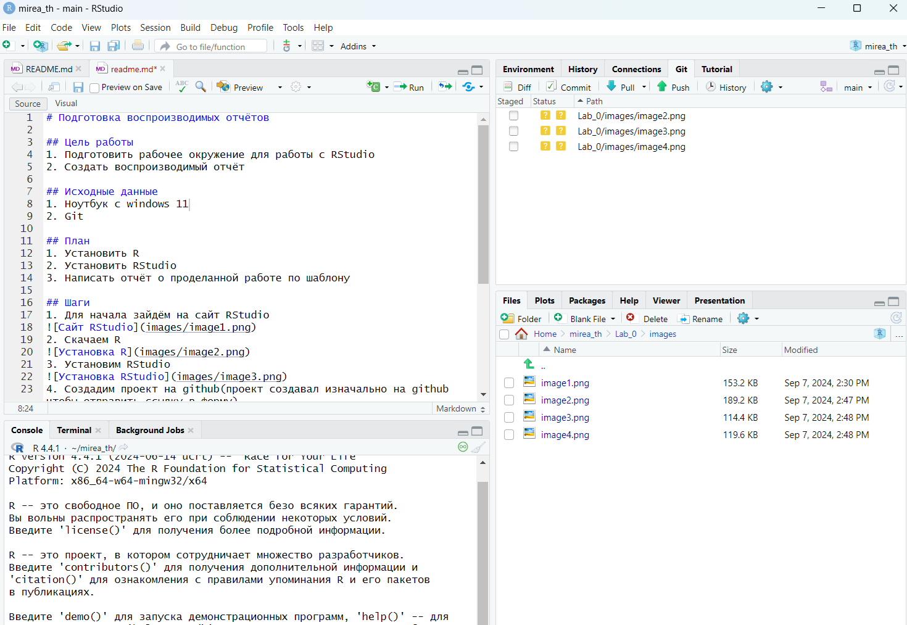
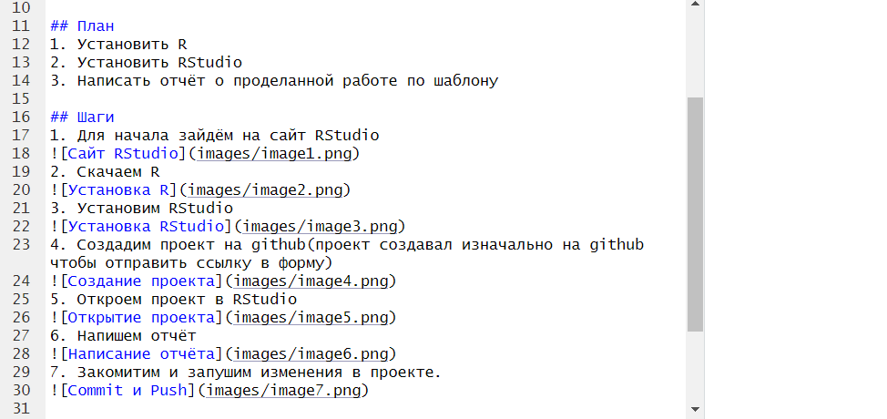
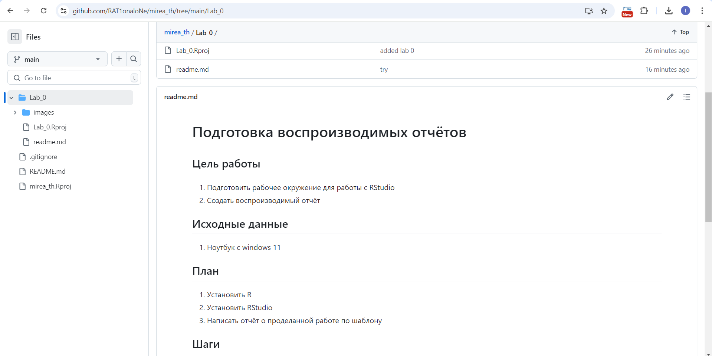

# Подготовка воспроизводимых отчётов

## Цель работы
1. Подготовить рабочее окружение для работы с RStudio
2. Создать воспроизводимый отчёт

## Исходные данные
1. Ноутбук с windows 11
2. Git

## План 
1. Установить R
2. Установить RStudio
3. Написать отчёт о проделанной работе по шаблону

## Шаги
1. Для начала зайдём на сайт RStudio

2. Скачаем R

3. Установим RStudio

4. Создадим проект на github(проект создавал изначально на github чтобы отправить ссылку в форму)

5. Откроем проект в RStudio

6. Напишем отчёт

7. Закомитим и запушим изменения в проекте.

## Оценка результата
Мы установили окружение для работы с RSTudio и подготовили воспроизводимый отчёт

## Вывод
Таким образом мы научились основам работы с git, подготовили окружение для будующих работ и поняли как создавать отчёты.