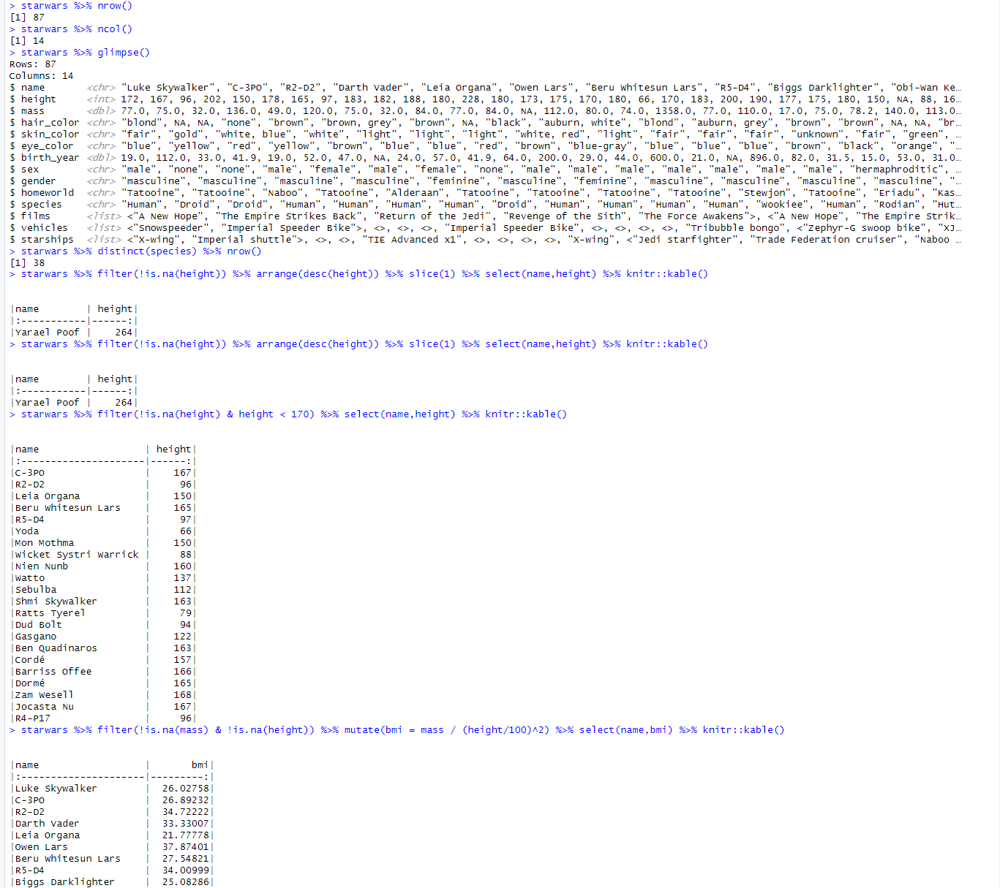
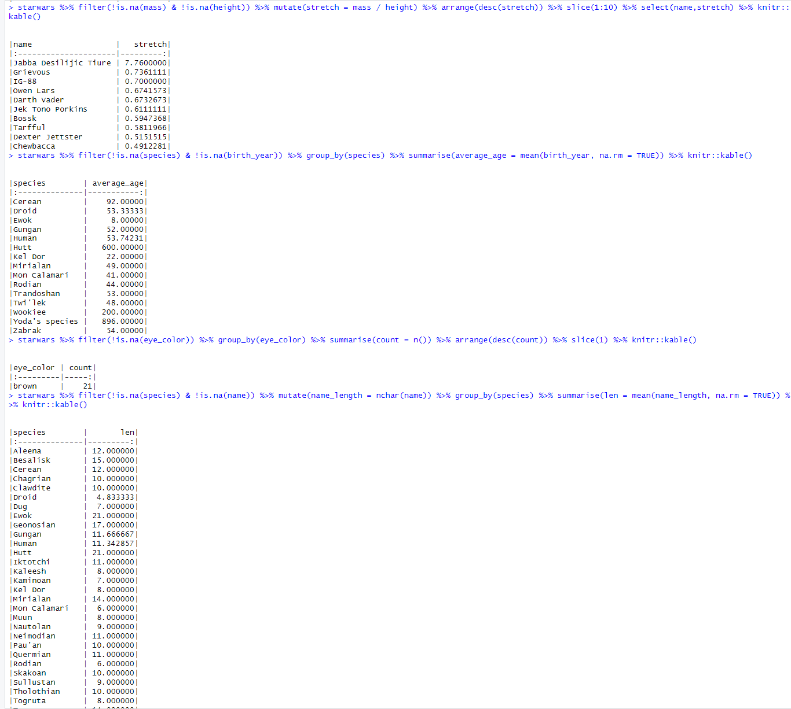

# Лабораторная работа №2

## Цель работы 

1. Развить практические навыки использования языка программирования R для
обработки данных
2. Закрепить знания базовых типов данных языка R
3. Развить практические навыки использования функций обработки данных пакета
dplyr – функции select(), filter(), mutate(), arrange(), group_by()

## Исходные данные

1.  Windows 11
2.  Git
3.  Rstudio

## Шаги

 1. Устанавливаем dplyr с помощью команды `install.packages("dplyr")`

 2. Загружаем библиотеки:
 
```{r}
library(dplyr)
library(knitr)
```

 3. Выполняем задания:

 Сколько строк в датафрейме?

```{r}
starwars %>% nrow()
```

 Сколько столбцов в датафрейме?

```{r}
starwars %>% ncol()
```

 Как просмотреть примерный вид датафрейма?

```{r}
starwars %>% glimpse()
```

 Сколько уникальных рас персонажей (species) представлено в данных?

```{r}
starwars %>%
  distinct(species) %>%
  nrow()
```

 Найти самого высокого персонажа.

```{r}
starwars %>%
  arrange(desc(height)) %>%
  slice_head(n = 1) %>%
  select(name, height)
```

 Найти всех персонажей ниже 170.

```{r}
starwars %>%
  filter(height < 170) %>%
  select(name, height) %>%
  kable
```

 Подсчитать ИМТ (индекс массы тела) для всех персонажей. ИМТ подсчитать по формуле.

```{r}
starwars %>%
  mutate(bmi = mass / (height / 100)^2) %>%
  select(name, height, mass, bmi) %>%
  kable()
```

 Скрин предыдущих шагов 
 
 Найти 10 самых “вытянутых” персонажей. “Вытянутость” оценить по отношению массы (mass) к росту (height) персонажей.

```{r}
starwars %>%
  mutate(stretchiness = mass / height) %>%
  arrange(desc(stretchiness)) %>%            
  select(name, height, mass, stretchiness) %>% 
  head(10)    
```

 Найти средний возраст персонажей каждой расы вселенной Звездных войн.

```{r}
starwars %>%
  filter(!is.na(birth_year)) %>%              
  group_by(species) %>%                       
  summarise(average_age = mean(birth_year, na.rm = TRUE)) %>% 
  arrange(desc(average_age)) %>%
  kable
```

 Найти самый распространенный цвет глаз персонажей вселенной Звездных войн.

```{r}
starwars %>%
  group_by(eye_color) %>%                     
  summarise(count = n()) %>%                  
  arrange(desc(count)) %>%                    
  slice(1)                                    
```

 Подсчитать среднюю длину имени в каждой расе вселенной Звездных войн.

```{r}
starwars %>%
  mutate(name_length = nchar(name)) %>%
  group_by(species) %>%                       
  summarise(average_name_length = mean(name_length, na.rm = TRUE)) %>% 
  arrange(desc(average_name_length)) %>%
  kable()
```

 Скрин предыдущих шагов 
## Оценка результата

В результате работы был проанализирован набор данных starwars

## Вывод

Были изучены функции библиотеки dplyr такие как: select(), filter(), mutate(), arrange(), group_by().